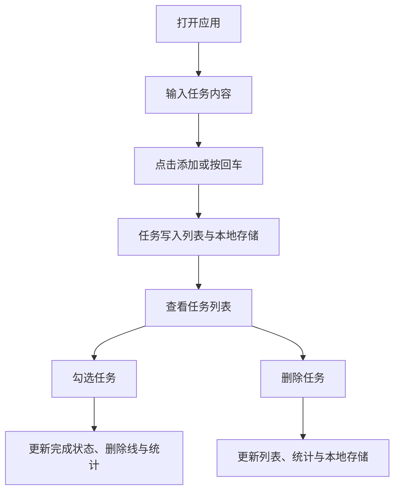

## 1. 产品概述
这是一个单页待办事项应用，帮助用户快速记录、勾选、删除和统计日常任务，并在刷新后保留数据。
- 主要解决轻量任务管理与临时待办易丢失的问题，面向个人用户与学生、办公人群。
- 产品价值在于零门槛使用、界面简洁清爽、在桌面端与移动端都能顺畅完成日常记录。

## 2. 核心功能

### 2.1 功能模块
1. **待办主页**：标题区、输入区、任务列表、统计区。

### 2.2 页面详情
| 页面名称 | 模块名称 | 功能说明 |
|-----------|-------------|---------------------|
| 待办主页 | 顶部标题区 | 展示应用名称、副标题与当前状态概览，建立清新现代的视觉第一印象。 |
| 待办主页 | 任务输入区 | 输入任务内容并点击按钮或按回车添加；为空时阻止添加并给出轻量提示。 |
| 待办主页 | 任务列表区 | 以卡片形式展示每条任务；支持勾选完成、显示删除线、单条删除。 |
| 待办主页 | 统计信息区 | 实时显示未完成数量、已完成数量与总任务数。 |
| 待办主页 | 本地存储层 | 通过浏览器本地存储保存任务数据，刷新页面后自动恢复。 |

## 3. 核心流程
用户进入页面后，先在输入框中填写待办内容并添加到列表；之后可以勾选任务切换完成状态，系统同步更新统计信息与样式；如果任务不再需要，可以直接删除；所有变更都会立即写入本地存储。

## 4. 用户界面设计
### 4.1 设计风格
- 主色调：清新的浅蓝、湖蓝与深蓝文字，辅以白色半透明卡片背景。
- 按钮样式：大圆角按钮，轻微渐变与阴影，悬停时有抬升反馈。
- 字体与字号：标题采用有个性的现代展示字体，正文采用清晰易读的衬线或人文字体组合。
- 布局样式：以居中主卡片为核心，结合顶部装饰光晕与统计胶囊，突出层次感。
- 图标建议：使用简洁线性图标强化输入、统计与删除操作。

### 4.2 页面设计概览
| 页面名称 | 模块名称 | UI 元素 |
|-----------|-------------|-------------|
| 待办主页 | 顶部标题区 | 大标题、渐变高光、副标题、柔和背景光斑 |
| 待办主页 | 任务输入区 | 圆角输入框、主操作按钮、聚焦高亮、阴影 |
| 待办主页 | 统计信息区 | 三个圆角统计卡片，数字突出，颜色分层明显 |
| 待办主页 | 任务列表区 | 玻璃拟态任务卡片、自定义复选框、删除按钮、完成态删除线 |

### 4.3 响应式
采用桌面优先设计，在平板和手机端自动调整卡片内边距、按钮尺寸和统计布局；任务项在小屏幕中保持清晰层次，按钮点击区域满足触控操作。
