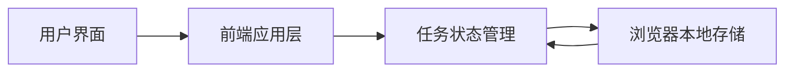

## 1. 架构设计


## 2. 技术说明
- 前端：HTML5 + CSS3 + JavaScript（原生，无框架）
- 初始化方式：直接构建静态前端页面文件
- 后端：无
- 数据存储：浏览器 `localStorage`

## 3. 路由定义
| 路由 | 用途 |
|-------|---------|
| / | 待办事项主页面，承载任务输入、列表展示、统计与本地存储逻辑 |

## 4. 数据模型
### 4.1 数据模型定义
```ts
type TodoItem = {
  id: string
  text: string
  completed: boolean
  createdAt: number
}
```

### 4.2 存储定义
- 本地存储键名：`todo-blue-app-items`
- 存储结构：`TodoItem[]` 的 JSON 字符串
- 读取时机：页面初始化时
- 写入时机：新增、切换完成状态、删除任务后立即写入

## 5. 交互与实现策略
- 输入框支持点击按钮添加，也支持按回车键快速提交。
- 当输入内容为空或仅包含空白字符时，阻止新增，避免无效数据。
- 点击任务前的复选框切换完成状态，完成时为文本添加删除线并弱化颜色。
- 点击删除按钮移除对应任务，并同步刷新统计数据与本地存储。
- 统计区实时显示未完成数量、已完成数量和总数。

## 6. 样式与响应式策略
- 使用 CSS 变量统一管理蓝色调、阴影、圆角与间距。
- 通过渐变背景、半透明卡片和柔和阴影构建现代清新的视觉风格。
- 使用 `@media` 断点优化窄屏布局，使输入区与统计区在手机端改为纵向堆叠。
- 优先采用语义化 HTML 结构和足够对比度，保证基本可访问性。
